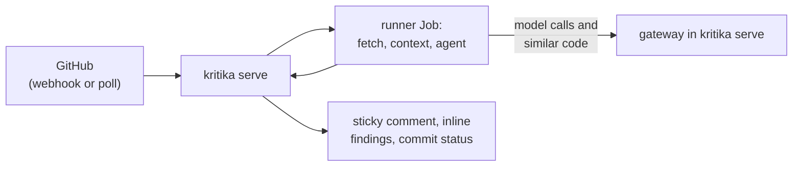

# kritika

**Repository-aware AI pull request review for GitHub.**

/// warning | Not production ready

kritika is early and under active development: configuration and the APIs
can still change from one release to the next, so read the
[changelog](https://github.com/home-operations/kritika/blob/main/CHANGELOG.md)
before upgrading. Schema changes arrive as migrations the leader applies.

///

kritika indexes a repository, reviews each pull request against that context,
posts one sticky summary comment plus inline findings and a commit status, and
answers follow-ups when the bot is @-mentioned. A pull request from a fork is
reviewed like any other unless the configuration excludes it. One deployment serves any
number of forge accounts, and every index, review and follow-up job runs in
its own Kubernetes Job pod that holds no provider key or App key.

## Features

- **Context beyond the diff.** Whole declarations the diff touches,
  definitions of identifiers on changed lines and callers of changed
  declarations, cut by tree-sitter, plus the most similar chunks from a
  VectorChord index of the default branch, and the issues the description
  says the pull request closes, which the review judges the change against.
- **An agent, not one prompt.** Each review is a bounded, read-only tool loop
  over the head commit, optionally with allowlisted commands (`gh`, `curl`,
  `fd`, `jq`, `rg`, `yq`) so it can read a dependency bump's release notes;
  `agent.steps: 1` makes it one call.
- **Fixes you can apply.** A finding offers its fix as a one-click suggestion,
  with a prompt a coding agent can apply it from.
- **Incremental reviews.** A later push is reviewed against what changed since
  the last review, an earlier finding it no longer finds has its thread
  resolved, `trigger.settle` folds a burst of force-pushes into one, and
  `trigger.limit` pauses a long-lived pull request's automatic reviews,
  as `@<bot> pause` does on request.
- **Follow-ups.** Someone with write access can @-mention the bot and get an
  answer in the thread, from an agent with a review's tools that reads the
  code and looks things up before it answers. Or reply `@<bot> dismiss <reason>` in a finding's
  thread to have it resolved and never raised again on that pull request;
  resolving the thread on the forge does the same.
- **Reactions.** The pull request carries the bot's 👀 while a review
  runs and its 👍 once one is posted, and a mention the bot answers the
  same, so a list of pull requests shows which have been reviewed.
- **A confidence score, opt-in.** A second model scores each reviewed pull
  request from 0 to 5; a repository that gates on it has the commit status
  fail under its threshold, so it can be a required check.
- **Approvals, opt-in.** A repository or the instance can have a review that
  finds nothing at P0 or P1 approve the pull request, and a later
  review that does withdraw it. With a confidence score, a pull request is
  approved when its score and the risk of its change allow it.
- **Flow diagrams, opt-in.** The summary can draw the flow a change adds or
  alters as a Mermaid diagram, so a reviewer sees the path before reading
  the code.
- **Providers and limits.** OpenRouter, OpenAI, Anthropic and OpenCode adapters, with
  per-account concurrency, daily review and monthly token caps. The provider
  key never enters a runner pod: the agent reaches its model through kritika's
  gateway.
- **Repository overrides.** A `.kritika.yaml`, read from the merge-base, can
  narrow the admin's settings and bring its own rules, context files and
  comment templates.
- **Skills.** A review is offered the [Agent Skills](https://agentskills.io)
  a repository keeps under `.agents/skills` and `.claude/skills`, by name and
  description, and reads one when it fits the pull request; they are read
  from the merge-base and grant no tool or command.
- **Configuration in git.** One YAML file holds the whole configuration, read
  at startup, and a change rolls the pods; secrets stay in Secrets, which reach
  kritika as environment variables.
- **Dashboard.** Sign-in, live review state, full model transcripts, the
  running configuration, repository on/off and an audit log.

## Where to next

- **[Setup](setup.md)**: install the chart, create the GitHub App, add a model
  key and an embedder, and get to the first review.
- **[Postgres with CloudNativePG](database.md)**: the database, its three
  roles, connection URIs, failover and backups.
- **[Security](security.md)**: hardening an install, what a runner holds,
  the egress gateway, runner tools and the sandbox.
- **[Configuration file](configuration.md)**: sign-in and role mappings, GitHub
  Apps, the repository settings, repository entries, accounts and egress.
- **[Models](models.md)**: providers and their keys, retries, fallback, the
  embedder, local models and OpenCode.
- **[Repository settings](repository-config.md)**: what a repository's
  `.kritika.yaml` can change.
- **[Helm chart values](chart-values.md)**: the chart's values, grouped.
- **[Reviews](reviews.md)**: when a review runs, what it posts, and the
  commands that steer it.
- **[Confidence and approvals](confidence.md)**: the confidence score, the
  commit status it can gate, risk, and when kritika approves.
- **[Dashboard](dashboard.md)**: the setup checklist, the Configuration page,
  repository on/off and actions.
- **[Metrics](metrics.md)**: what kritika exports to Prometheus.
- **[Development](development.md)**: building, testing, evaluation and the
  cluster loop.
